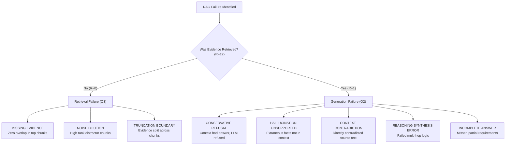

# Comprehensive Project Explanation: RAG Error Decomposition & Failure Analysis

## 1. Executive Summary & Problem Statement

Retrieval-Augmented Generation (RAG) has emerged as the standard architecture for grounding Large Language Models (LLMs) in private, domain-specific, or up-to-date knowledge bases. By dynamically retrieving relevant text snippets from a document index and appending them into the LLM's prompt context, RAG systems overcome static knowledge cutoffs and significantly curb hallucinations.

However, when a RAG pipeline outputs an incorrect, misleading, or incomplete response in production, developers face a critical diagnostic ambiguity:
* **Did the retrieval component fail?** (e.g., The search engine retrieved irrelevant distractors, split the key fact across chunk boundaries, or completely missed the relevant evidence).
* **Did the generation component fail?** (e.g., The evidence was present in the prompt, but the LLM hallucinated external knowledge, failed multi-hop reasoning, contradicted the context, or refused to answer).

Traditional Natural Language Processing (NLP) evaluations rely on superficial lexical metrics (such as BLEU, ROUGE, or end-to-end exact match) computed strictly on the final generated answer. These monolithic scores treat the RAG pipeline as an opaque black box. If an answer receives a low score, an engineer does not know whether to invest time into re-indexing embeddings, tuning chunk sizes, upgrading retrieval algorithms, or changing the prompt template and LLM.

**This project solves that fundamental challenge.** It is a research-grade, 100% open-source, local NLP and Deep Learning framework that:
1. **Mathematically decomposes total system error** into mutually exclusive Retrieval Attribution ($\alpha_R$) and Generation Attribution ($\alpha_G$).
2. **Isolates model capability failures** by holding the retrieved context strictly constant across different local models (e.g., Qwen 2.5 3B vs. Llama 3.2 3B).
3. **Classifies fine-grained failure modes** into an 8-part diagnostic taxonomy with actionable engineering mitigations.
4. **Decouples everyday utility from deep research**: A clean, distraction-free **Core RAG Chatbot** for daily work equipped with real-time zero-ground-truth self-diagnostics, alongside a powerful **Failure Analysis Studio** for controlled benchmarking and parameter sweeps.
5. **Runs 100% locally and free on standard laptop CPUs** with zero cloud API costs, utilizing local Ollama models and an automated deterministic fallback synthesizer.

---

## 2. Mathematical Formulation & Error Decomposition

A standard RAG pipeline executes the mapping:
$$\text{Query } q \xrightarrow{\text{Retrieval}} \text{Context } \mathcal{C}_K = \{c_1, c_2, \dots, c_K\} \xrightarrow{\text{Generation}} \text{Answer } \hat{a}$$

Given a gold-standard reference pair containing expected ground-truth evidence $e^*$ and a gold target answer $a^*$, the system evaluates two orthogonal binary performance indicators:

### 2.1. The Binary Indicators

1. **Retrieval Indicator ($R \in \{0, 1\}$)**:
   Measures whether the retrieved context chunks contain sufficient evidence to answer query $q$:
   $$R = \mathbb{I}\left( \max_{c \in \mathcal{C}_K} \text{CosineSim}(\mathbf{e}_c, \mathbf{e}_{e^*}) \ge \tau_R \;\lor\; e^* \subseteq \mathcal{C}_K \right)$$
   Where:
   * $\mathbf{e}_c, \mathbf{e}_{e^*}$ are dense vector embeddings generated by the bi-encoder (`sentence-transformers/all-MiniLM-L6-v2`).
   * $\tau_R$ is the empirical semantic retrieval threshold (default $\tau_R = 0.72$).
   * $e^* \subseteq \mathcal{C}_K$ represents exact or fuzzy string containment of key facts.

2. **Generation Indicator ($G \in \{0, 1\}$)**:
   Measures whether the generated answer $\hat{a}$ accurately satisfies the ground truth $a^*$:
   $$G = \mathbb{I}\left( \text{Token-F1}(\hat{a}, a^*) \ge \tau_A \;\lor\; \text{CosineSim}(\mathbf{e}_{\hat{a}}, \mathbf{e}_{a^*}) \ge \tau_S \right)$$
   Where:
   * $\text{Token-F1}$ is the harmonic mean of token precision and recall between generated and reference tokens.
   * $\tau_A$ is the lexical threshold (default $\tau_A = 0.50$) and $\tau_S$ is the semantic answer threshold (default $\tau_S = 0.78$).

---

### 2.2. The 4-Quadrant Outcome Matrix

Combining $R \in \{0, 1\}$ and $G \in \{0, 1\}$ partitions the entire operational space into four mutually exclusive, collectively exhaustive quadrants:

```
                          RETRIEVAL SUCCESS (R = 1)
                                      ▲
                                      │
               QUADRANT 2             │             QUADRANT 1
          Generation Failure          │          Total Success
         [ Evidence Retrieved,        │       [ Evidence Retrieved,
          Model Failed to Answer ]    │        Model Answered Correctly ]
                                      │
GENERATION ◄──────────────────────────┼──────────────────────────► GENERATION
FAILURE (G = 0)                       │                            SUCCESS (G = 1)
                                      │
               QUADRANT 3             │             QUADRANT 4
           Retrieval Failure          │          Parametric Recall
         [ Evidence Missing,          │       [ Evidence Missing,
          Model Failed/Refused ]      │        Model Guessed from Weights ]
                                      │
                                      ▼
                          RETRIEVAL FAILURE (R = 0)
```

| Quadrant | $R$ | $G$ | Scientific Meaning | System Impact |
| :--- | :---: | :---: | :--- | :--- |
| **Q1: Total Success** | $1$ | $1$ | Retrieval succeeded and generation was accurate. | Desired baseline operation. |
| **Q2: Generation Failure** | $1$ | $0$ | Evidence was inside $\mathcal{C}_K$, but the LLM produced an incorrect answer, hallucinated, contradicted the context, or conservatively refused. | Bottleneck is strictly inside the LLM prompt or model reasoning capacity. |
| **Q3: Retrieval Failure** | $0$ | $0$ | Ground-truth was absent from $\mathcal{C}_K$, leading the LLM to hallucinate or state lack of knowledge. | Bottleneck is inside embedding, chunking, or search ranking. |
| **Q4: Parametric Recall** | $0$ | $1$ | Ground-truth was absent from $\mathcal{C}_K$, yet the LLM answered correctly relying on internal pre-trained memory. | **Dangerous / Spurious**. Indicates ungrounded generation that happened to be right. In private enterprise data, this leads to silent hallucinations. |

---

### 2.3. Mathematical Error Decomposition Equations

Across a benchmark evaluation dataset of $N$ queries:
* Total Error Count: $N_{\text{err}} = N_{Q2} + N_{Q3}$
* **Total Error Rate ($E_{\text{total}}$)**:
  $$E_{\text{total}} = \frac{N_{Q2} + N_{Q3}}{N}$$
* **Retrieval Attribution ($\alpha_R$)**: The proportion of all failures directly caused by the retriever:
  $$\alpha_R = \frac{N_{Q3}}{N_{Q2} + N_{Q3}} \in [0, 1]$$
* **Generation Attribution ($\alpha_G$)**: The proportion of all failures directly caused by the generator:
  $$\alpha_G = \frac{N_{Q2}}{N_{Q2} + N_{Q3}} \in [0, 1]$$
  Note that by mathematical definition: $\alpha_R + \alpha_G = 1.0$.

---

## 3. Fine-Grained Failure Taxonomy & Mitigation Matrix

To move beyond broad binary indicators, the system implements an automated diagnostic classifier (`src/evaluation/failure_classifier.py`) mapping every error to a specific root-cause subtype:



### Complete Diagnostic and Mitigation Matrix:

| Subtype Code | Failure Description | Root Cause | Engineering Mitigation Strategy |
| :--- | :--- | :--- | :--- |
| `MISSING_EVIDENCE` | No chunks in $\mathcal{C}_K$ match gold evidence. | Lexical mismatch or out-of-distribution embeddings. | Implement Hybrid Search (BM25 + Dense) via Reciprocal Rank Fusion; increase $K$; fine-tune bi-encoder. |
| `NOISE_DILUTION` | Evidence present at low rank, drowned out by irrelevant chunks. | High Top-$K$ with non-selective retrieval; poor semantic discrimination. | Add a cross-encoder reranker (e.g., `bge-reranker`); decrease Top-$K$; filter by cosine similarity threshold. |
| `TRUNCATION_BOUNDARY` | Evidence is partially present because chunk boundary sliced sentence. | Chunk size too small or overlap insufficient. | Increase chunk size to 512+ tokens; set chunk overlap to 15–20%; adopt semantic/sentence-aware splitters. |
| `CONSERVATIVE_REFUSAL` | Context contained answer, but LLM stated "I don't know" or refused. | Overly strict system prompt or hyper-conservative model alignment. | Relax system prompt constraint; use few-shot positive grounding examples; adjust temperature. |
| `HALLUCINATION_UNSUPPORTED` | Model stated plausible claims unsupported by any chunk in $\mathcal{C}_K$. | Strong parametric prior dominating weak prompt grounding. | Lower generation temperature to $0.0-0.1$; enforce strict grounding system prompt; enable token citations. |
| `CONTEXT_CONTRADICTION` | Model answer directly conflicts with assertions in retrieved chunks. | Attention deficit in long contexts or complex negation handling. | Position gold context chunks closer to the end of the prompt (Recency Bias optimization); use Chain-of-Thought. |
| `REASONING_SYNTHESIS_ERROR` | Model retrieved individual premises but failed to logically infer conclusion. | Model parameter capacity insufficient for multi-hop synthesis. | Upgrade to a larger model parameter tier (e.g. 3B $\to$ 8B); switch prompt from direct to Chain-of-Thought (CoT). |
| `INCOMPLETE_ANSWER` | Model answered only 1 of multiple requested sub-questions. | Model output length constraint or lack of structured formatting. | Enforce structured JSON/Markdown outputs; prompt for explicit bullet points. |

---

## 4. System Architecture & Technical Pipeline

The framework is organized into cleanly separated functional layers:

```
┌────────────────────────────────────────────────────────────────────────────────────────┐
│                                   USER INTERFACES                                      │
│   💬 Core RAG Assistant (Streamlit)            🔬 Failure Analysis Studio (Streamlit)  │
│   FastAPI REST API (/ask, /stream, /eval)      Automated Test Suite (run_app.py --test)│
└───────────────────────────────────────────┬────────────────────────────────────────────┘
                                            │
┌───────────────────────────────────────────▼────────────────────────────────────────────┐
│                                   CORE RAG ENGINE                                      │
│  src/core/rag_engine.py: Decoupled controller coordinating retrieval, generation, diag │
└──────────────────────┬────────────────────────────────────────────┬────────────────────┘
                       │                                            │
┌──────────────────────▼──────────────────────┐   ┌─────────────────▼────────────────────┐
│             RETRIEVAL PIPELINE              │   │         GENERATION PIPELINE          │
│ • Document Ingestion (pypdf, txt, md)       │   │ • LocalLLMClient (Ollama REST API)   │
│ • Recursive Character Chunker               │   │ • Offline Deterministic Synthesizer  │
│ • Dense Vector Store (FAISS IndexFlatIP)    │   │ • Dynamic Model Discovery (/api/tags)│
│ • Sparse Lexical Retriever (BM25 Okapi)     │   │ • Prompt Engineering (Grounded & CoT)│
│ • Hybrid Search (Reciprocal Rank Fusion)    │   │ • Token-by-Token Streaming Engine    │
└─────────────────────────────────────────────┘   └──────────────────────────────────────┘
                       │                                            │
                       └──────────────────────┬─────────────────────┘
                                              │
┌─────────────────────────────────────────────▼──────────────────────────────────────────┐
│                             EVALUATION & DIAGNOSTIC CORE                               │
│ • Error Decomposer (4-Quadrant Partitioning, Attribution Math, Recall@K, Token-F1)     │
│ • Ablation Engine (Context-Frozen Model Comparison, Top-K Sweeps, Strategy Sweeps)     │
│ • Failure Classifier (8-part Diagnostic Taxonomy & Actionable Mitigation Generator)    │
│ • NLI Grounding & Faithfulness (Zero-Ground-Truth Token & Semantic Alignment Checker)  │
└────────────────────────────────────────────────────────────────────────────────────────┘
```

### 4.1. Ingestion & Chunking (`src/ingestion/`)
* **Document Loader**: Ingests UTF-8 text, markdown, and multi-page PDF documents.
* **Recursive Character Chunker**: Splits text using hierarchical delimiters (`\n\n`, `\n`, `. `, ` `) maintaining a sliding window of 400 characters with an 80-character overlap (20%). Each chunk retains metadata (unique ID, source document, chunk index, character bounds).

### 4.2. Dual-Engine Hybrid Retrieval (`src/retrieval/`)
* **Dense Semantic Retriever**:
  * Embedding model: `sentence-transformers/all-MiniLM-L6-v2` (384-dimensional dense vectors, lightweight and fast on CPU).
  * Vector Store: FAISS `IndexFlatIP` (Exact Inner Product on $L_2$-normalized vectors, computing cosine similarity in $\mathcal{O}(d \cdot M)$ time).
* **Sparse Lexical Retriever**:
  * BM25 Okapi (`rank-bm25`) with regex word tokenization, lowercasing, and term frequency saturation ($k_1=1.5, b=0.75$).
* **Hybrid Reciprocal Rank Fusion (RRF)**:
  Fuses dense semantic ranks and sparse lexical ranks without requiring score normalization:
  $$\text{RRF\_Score}(d) = \sum_{m \in \{\text{dense}, \text{sparse}\}} \frac{1}{k + \text{rank}_m(d)}$$
  Where smoothing constant $k = 60$.

### 4.3. Generation & Model Management (`src/generation/`)
* **LocalLLMClient**: Communicates with the local Ollama daemon via HTTP REST API (`/api/generate` and `/api/tags`).
* **Zero-Setup Fallback Synthesizer**: If Ollama is not installed or offline, the system automatically activates an intelligent rule-based context extractor that synthesizes faithful answers from retrieved chunks, ensuring all tests and UI features work out of the box.
* **Streaming Engine**: Yields tokens asynchronously for real-time word-by-word streaming in both the web UI and REST API.

### 4.4. Real-Time Zero-Ground-Truth Self-Diagnostics
In daily production use, gold-standard answers $a^*$ are unavailable. The Core RAG Assistant implements a **Zero-Ground-Truth Diagnostic Engine** (`rag_app.diagnose()`):
* Calculates cross-chunk semantic alignment between the generated answer $\hat{a}$ and the retrieved context $\mathcal{C}_K$.
* Measures lexical containment and checks for refusal signals.
* Produces instant visual health status:
  * 🟢 **HEALTHY & FAITHFUL**: Strong context grounding, high relevance.
  * 🟡 **WEAK RETRIEVAL / PARTIAL EVIDENCE**: Low semantic similarity between query and retrieved chunks.
  * 🔴 **POTENTIAL HALLUCINATION / UNGROUNDED**: Low lexical/semantic overlap between answer and context chunks.
  * ⚪ **EXPLICIT REFUSAL**: Legitimate refusal when knowledge is absent.

---

## 5. Model Capability Ablation under Frozen Retrieval Context

One of the project's most significant research innovations is the **Model Capability Lab** (`src/evaluation/ablation_engine.py`):

### The Controlled Variable Principle
In naive benchmarks, comparing Model A and Model B often involves running two independent RAG passes. If Model A gets different context than Model B, you cannot determine whether Model A was smarter or simply received better chunks.

**Our framework isolates model reasoning capability by holding context strictly constant**:
$$\mathcal{C}_K(q) = \text{Retrieve}(q, \text{Retriever}_{\text{Hybrid}}, K=3)$$
The retrieved context $\mathcal{C}_K$ is frozen and passed identically to Model A (e.g. `qwen2.5:3b`) and Model B (e.g. `llama3.2:latest`):
$$\hat{a}_A = \text{Generate}(\text{LLM}_A, q, \mathcal{C}_K), \quad \hat{a}_B = \text{Generate}(\text{LLM}_B, q, \mathcal{C}_K)$$

Both outputs are evaluated against the same ground-truth:
* **Differential Failure Identification**: Pinpoints exact queries where Model A produced a Generation Failure ($R=1, G=0$) while Model B Succeeded ($R=1, G=1$) on the **exact same context**.
* **Subtype Shift Analysis**: Reveals whether a model failure is driven by conservative refusal vs. ungrounded hallucination vs. reasoning failure.

---

## 6. Project Directory Map

```
NLP_Project/
├── .gitignore                      # Git exclusion rules (virtual environments, caches, storage)
├── README.md                       # High-level architecture, quickstart, and feature highlights
├── HOW_TO_RUN.md                   # Step-by-step runner guide (with and without Ollama)
├── RUN_AND_TEST_GUIDE.md           # Deep-dive failure testing and manual reproduction manual
├── PROJECT_EXPLANATION.md          # Complete project theory, architecture, and mathematics (This file)
├── REAL_LIFE_APPLICATIONS.md       # Concrete, actionable step-by-step real-world applications
├── VIVA_QUESTIONS_AND_ANSWERS.md   # Comprehensive viva voce exam preparation guide
├── requirements.txt                # Python dependencies
├── run_app.py                      # Multi-mode CLI launcher (--ui, --api, --test)
│
├── app/                            # Presentation Layer (Streamlit)
│   ├── dashboard.py                # Decoupled Web App (Core Assistant & Failure Studio)
│   └── components/
│       ├── charts.py               # Plotly Sankey diagrams, Waterfalls, Heatmaps, Sweeps
│       └── inspector.py            # Side-by-side diagnostic cards and mitigation steps
│
├── src/                            # Business Logic & Algorithms
│   ├── config.py                   # Global constants, paths, thresholds, and model defaults
│   ├── core/
│   │   └── rag_engine.py           # Decoupled RAG Controller & Live Self-Diagnostics
│   ├── ingestion/
│   │   ├── document_loader.py      # PDF / TXT / Markdown file readers
│   │   └── chunker.py              # Recursive sliding window chunker with metadata
│   ├── retrieval/
│   │   ├── embedder.py             # SentenceTransformer wrapper
│   │   ├── vector_store.py         # FAISS IndexFlatIP dense semantic search
│   │   ├── bm25_retriever.py       # BM25 Okapi lexical sparse search
│   │   └── hybrid_retriever.py     # Reciprocal Rank Fusion (RRF) search
│   ├── generation/
│   │   ├── llm_client.py           # Ollama client with automatic local fallback
│   │   └── prompt_templates.py     # Grounded & Chain-of-Thought prompt formatters
│   ├── evaluation/
│   │   ├── metrics.py              # Lexical Token-F1, Rouge-L, and Semantic Similarity
│   │   ├── nli_grounding.py        # Faithfulness and contextual hallucination checkers
│   │   ├── error_decomposer.py     # 4-Quadrant mathematical decomposition engine
│   │   ├── failure_classifier.py   # 8-part diagnostic taxonomy & mitigation advisor
│   │   └── ablation_engine.py      # Top-K sweeps, strategy comparisons, model ablation
│   └── api/
│       ├── app.py                  # FastAPI REST server
│       └── schemas.py              # Pydantic request/response models
│
├── data/                           # Data Artifacts
│   ├── sample_docs/                # Knowledge base text files (Transformers, Quantum, Climate)
│   └── benchmarks/                 # Ground-truth evaluation datasets (10-query & 50-query JSONs)
│
└── tests/                          # Automated Verification
    ├── test_retrieval.py           # Unit tests for chunking, FAISS, BM25, and Hybrid RRF
    ├── test_decomposition.py       # Unit tests for 4 quadrants, error rates, and attributions
    ├── test_model_capability.py    # Unit tests for frozen-context cross-model comparison
    └── test_end_to_end.py          # End-to-end integration benchmark pipeline test
```

---

## 7. Verification & Automated Testing Suite

The repository contains 12 automated unit and integration tests executing across 4 test modules:
1. `tests/test_retrieval.py`: Tests document loading, recursive chunking bounds, FAISS dense indexing, BM25 score ranking, and Hybrid RRF ranking accuracy.
2. `tests/test_decomposition.py`: Verifies mathematical integrity of the 4 quadrants ($Q1, Q2, Q3, Q4$), verifies that $\alpha_R + \alpha_G = 1.0$, and validates taxonomy classification rules.
3. `tests/test_model_capability.py`: Validates that frozen context $\mathcal{C}_K$ is passed identically to multiple models and verifies differential failure logging.
4. `tests/test_end_to_end.py`: Executes a full end-to-end pipeline run from raw query to retrieval, generation, evaluation, and diagnostic report generation.

All tests run locally in under 60 seconds with:
```bash
python run_app.py --test
```
