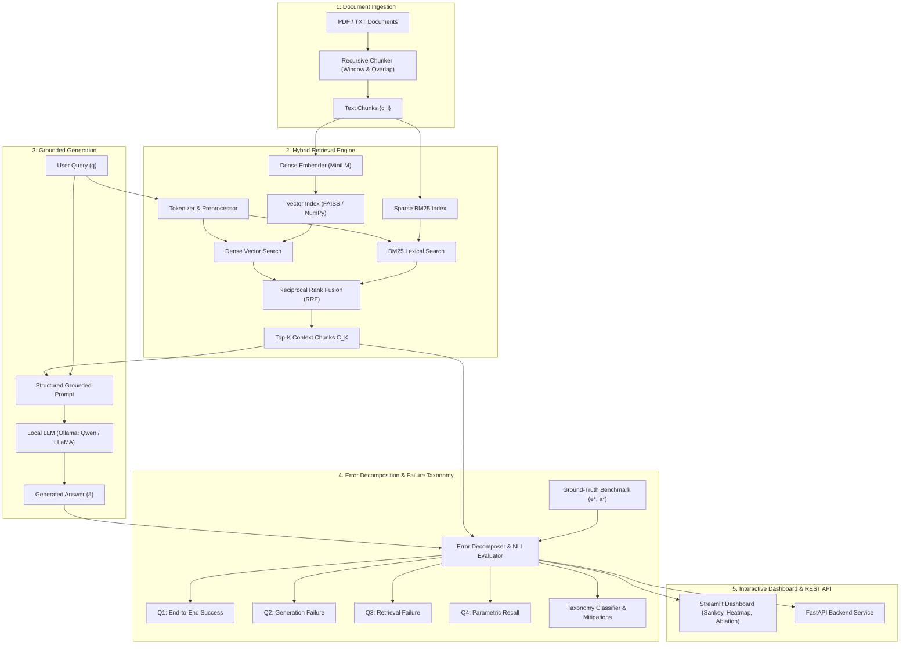

# RAG Retrieval-vs-Generation Error Decomposition and Failure Analysis

A research-grade, 100% open-source, and fully local Natural Language Processing (NLP) and Deep Learning framework designed to systematically investigate **why a Retrieval-Augmented Generation (RAG) system produces incorrect answers**.

The project isolates and mathematically quantifies the exact contribution of **Retrieval Failures** versus **Generation Failures**, classifies fine-grained failure modes (e.g. *Missing Evidence*, *Noise Dilution*, *Boundary Truncation*, *Hallucinations*, *Context Contradictions*, *Reasoning Synthesis Errors*), and analyzes how failures fluctuate across **Top-K**, **retrieval methods**, and **question difficulty**.

---

## 🌟 Key Features

* **Completely Free & GPU-Independent**: Runs locally on a standard laptop CPU without paid cloud APIs, subscriptions, or proprietary models.
* **Mathematical Error Decomposition**: Partitions total failure rate $E_{\text{total}}$ into mutually exclusive surfaces:
  $$E_{\text{total}} = P(R=0, G=0) + P(R=1, G=0)$$
  Quantifying Retrieval Attribution ($\alpha_R$) and Generation Attribution ($\alpha_G$).
* **Dual-Engine Retrieval**: Hybrid Search combining Dense Bi-encoder semantic retrieval (`sentence-transformers` / PyTorch) and Sparse Lexical retrieval (BM25 Okapi) fused via Reciprocal Rank Fusion (RRF).
* **Local LLM Integration**: Native support for locally running **Ollama** (`qwen2.5:3b`, `llama3.2`, etc.) with automated deterministic offline fallbacks for rapid headless benchmarking.
* **Fine-Grained Failure Taxonomy**: Automated diagnostic classification with actionable engineering mitigations for each detected failure mode.
* **Multi-Factor Sensitivity & Ablation Engine**: Systematic parameter sweeps across Top-$K \in [1..10]$, Chunk Size, Retrieval Strategy (Dense vs Sparse vs Hybrid), and Question Complexity.
* **Interactive Streamlit Research Dashboard**: 6 modular research views with interactive Plotly Sankey diagrams, waterfall attribution charts, $2 \times 2$ outcome confusion matrices, live document query inspector, sample drill-down, and academic report export.
* **Production-Ready FastAPI Backend**: REST API for seamless programmatic integration.

---

## 📐 Mathematical Formulation

A standard RAG pipeline operates as:
$$\text{Query } q \xrightarrow{\text{Retrieval}} \text{Context } \mathcal{C}_K = \{c_1, \dots, c_K\} \xrightarrow{\text{Generation}} \text{Answer } \hat{a}$$

Given ground-truth evidence $e^*$ and reference answer $a^*$, the system evaluates two binary indicators:
1. **Retrieval Indicator ($R \in \{0, 1\}$)**:
   $$R = \mathbb{I}\left( \max_{c \in \mathcal{C}_K} \text{Sim}(c, e^*) \ge \tau_R \lor e^* \subseteq \mathcal{C}_K \right)$$
2. **Generation Indicator ($G \in \{0, 1\}$)**:
   $$G = \mathbb{I}\left( \text{F1}(\hat{a}, a^*) \ge \tau_A \lor \text{Sim}(\hat{a}, a^*) \ge \tau_S \right)$$

This defines a **4-Quadrant Outcome Space**:

| Quadrant | Retrieval ($R$) | Generation ($G$) | Outcome Interpretation |
| :---: | :---: | :---: | :--- |
| **Q1: Success** | 1 | 1 | Ground-truth retrieved, accurate answer generated. |
| **Q2: Generation Failure** | 1 | 0 | Evidence was in context, but LLM failed (hallucination, contradiction, synthesis error). |
| **Q3: Retrieval Failure** | 0 | 0 | Evidence was missing from context, resulting in an erroneous answer or refusal. |
| **Q4: Parametric Recall** | 0 | 1 | Evidence was missing, but LLM answered correctly from pretraining weights (spurious/unreliable). |

### Error Decomposition Equation
$$\text{Total Error Rate } E_{\text{total}} = \frac{N_{\text{Q2}} + N_{\text{Q3}}}{N}$$
$$\text{Retrieval Attribution } \alpha_R = \frac{N_{\text{Q3}}}{N_{\text{Q2}} + N_{\text{Q3}}}$$
$$\text{Generation Attribution } \alpha_G = \frac{N_{\text{Q2}}}{N_{\text{Q2}} + N_{\text{Q3}}}$$

---

## 🏗️ System Architecture



---

## 🔬 Fine-Grained Failure Taxonomy

| Surface | Failure Subtype | Root Cause Description | Prioritized Engineering Mitigation |
| :--- | :--- | :--- | :--- |
| **Retrieval** | `MISSING_EVIDENCE` | Recall@K = 0; no semantic overlap with gold evidence. | Increase Top-K; enable Hybrid RRF; tune embedding model. |
| **Retrieval** | `NOISE_DILUTION` | Evidence retrieved but buried among irrelevant distractor chunks. | Deploy Cross-Encoder reranker; apply contextual compression. |
| **Retrieval** | `TRUNCATION_BOUNDARY` | Evidence split across chunk boundary, breaking syntax or premise. | Increase chunk size or chunk overlap; use semantic chunking. |
| **Generation** | `HALLUCINATION_UNSUPPORTED` | Claims generated that have zero factual basis in retrieved context. | Lower temperature to 0.0; enforce strict negative prompt constraints. |
| **Generation** | `CONTEXT_CONTRADICTION` | Answer asserts facts that directly negate context statements. | Mandate inline citation tagging (`[Chunk X]`). |
| **Generation** | `REASONING_SYNTHESIS_ERROR` | Premises are present, but multi-hop deductive synthesis fails. | Introduce Chain-of-Thought (CoT) prompting or sub-query splitting. |
| **Generation** | `CONSERVATIVE_REFUSAL` | Model outputs "I don't know" despite context having sufficient evidence. | Soften conservative refusal threshold in prompt instructions. |

---

## 📁 Repository Structure

```
NLP_Project/
├── README.md                      # Academic documentation & manual
├── requirements.txt               # Free & lightweight dependencies
├── run_app.py                     # Convenience launcher (Dashboard, API, Tests)
├── data/
│   ├── sample_docs/               # Knowledge base documents (NLP, Quantum, Climate)
│   │   ├── nlp_transformers_rag.txt
│   │   ├── quantum_computing.txt
│   │   └── climate_science.txt
│   └── benchmarks/                # Curated evaluation benchmarks
│       ├── quick_test_benchmark_10.json
│       └── rag_failure_benchmark_50.json
├── src/
│   ├── config.py                  # Global settings, models, thresholds
│   ├── core/
│   │   └── rag_engine.py          # Decoupled Core RAG Engine (RAGApp & Live Diagnostics)
│   ├── ingestion/
│   │   ├── document_loader.py     # PDF & TXT file parser
│   │   └── chunker.py             # Recursive chunking & token tracking
│   ├── retrieval/
│   │   ├── embedder.py            # SentenceTransformers + PyTorch fallback
│   │   ├── vector_store.py        # FAISS IndexFlatIP + NumPy fallback
│   │   ├── bm25_retriever.py      # BM25 Okapi lexical retriever
│   │   └── hybrid_retriever.py    # Reciprocal Rank Fusion (RRF)
│   ├── generation/
│   │   ├── prompt_templates.py    # Grounded, CoT, and strict prompt builders
│   │   └── llm_client.py          # Local Ollama client (streaming & non-streaming)
│   ├── evaluation/
│   │   ├── metrics.py             # Recall@K, Token F1, Rouge-L, Semantic Sim
│   │   ├── nli_grounding.py       # Faithfulness & Hallucination detection
│   │   ├── error_decomposer.py    # 4-Quadrant mathematical decomposition
│   │   ├── failure_classifier.py  # Taxonomy classifier & mitigation guide
│   │   └── ablation_engine.py     # Top-K sweeps, Strategy sweeps, and Model Capability comparison
│   └── api/
│       ├── app.py                 # FastAPI REST server
│       └── schemas.py             # Pydantic schemas
├── app/
│   ├── dashboard.py               # Dual-Mode Streamlit App (Core RAG Chat & Failure Studio)
│   └── components/
│       ├── charts.py              # Sankey, Waterfall, Heatmap, Sensitivity, Model Comparison plots
│       └── inspector.py           # Side-by-side failure diagnostic cards
└── tests/
    ├── test_retrieval.py          # Unit tests for ingestion and search
    ├── test_decomposition.py      # Unit tests for math decomposition & quadrants
    ├── test_model_capability.py   # Unit tests for multi-model comparison under constant retrieval
    └── test_end_to_end.py         # Complete benchmark integration test
```

---

## 🚀 Quickstart Guide

### 1. Prerequisites
- Python 3.10+ installed
- *(Optional)* [Ollama](https://ollama.com) installed with lightweight local models (e.g. `ollama run qwen2.5:3b` or `ollama run llama3.2`).
  > **Note**: If Ollama is not installed or offline, the system automatically uses its built-in fast local synthesizer, so everything runs out of the box with zero setup!

### 2. Install Dependencies
```bash
pip install -r requirements.txt
```

### 3. Launch the Streamlit Research Dashboard
```bash
python run_app.py
```
Open your browser to `http://localhost:8501`.

### 4. Launch the FastAPI Backend (Optional)
```bash
python run_app.py --api
```
Interactive API documentation will be available at `http://127.0.0.1:8000/docs`.

### 5. Run the Automated Test Suite
```bash
python run_app.py --test
```

---

## 📊 Dashboard Modules

1. **💬 Live RAG & Inspector**: Test live queries, view retrieved chunks, and inspect generated answers with similarity score bars.
2. **🧪 Benchmark Evaluation**: Execute 10-query or 50-query benchmarks to calculate accuracy, error rates, and failure attributions.
3. **📊 Error Decomposition**: Interactive Plotly Sankey diagram, Waterfall attribution chart, $2 \times 2$ Confusion Matrix, and Subtype distributions.
4. **📈 Ablation & Sensitivity**:
   - **Top-K Context Depth Sweep**: Sensitivity curves across Top-$K \in [1..8]$.
   - **Retrieval Strategy Sweep**: Comparative evaluation across Dense vs Sparse vs Hybrid retrieval.
   - **🤖 Model Capability Analysis (Constant Retrieval Context)**: Holds context $\mathcal{C}_K$ strictly constant while comparing multiple local Ollama models (e.g. `qwen2.5:3b` vs `llama3.2:latest`), generating comparative success/failure charts, subtype shifts, and a **Differential Failure Case Inspector** identifying cases where one model succeeded while another failed on identical context!
5. **🔍 Sample Deep Dive**: Filterable sample viewer displaying gold evidence, model outputs, and actionable engineering mitigations.
6. **📝 Academic Research Summary**: Auto-generates a publication-ready academic summary report with empirical tables.

---

## 📄 License
MIT Open Source License. Free to use, adapt, and distribute for academic and commercial purposes.
